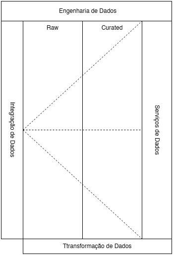
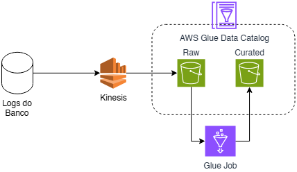

# Data Lakehouse com Apache Iceberg

Este projeto implementa um pipeline de ingestão e processamento transacional de dados no estilo Lakehouse, utilizando Apache Iceberg e PySpark, conforme o notebook `TrabalhoLakehouse.ipynb`.

---
## Objetivo

Criar um pipeline de dados que simule ingestão, pré-processamento e persistência transacional (ACID) de dados de pedidos de e-commerce, adotando melhores práticas de Data Lakehouse e requisitos técnicos detalhados.

---
## Diagrama da Arquitetura
Conceitual                                          |  Logico
:--------------------------------------------------:|:----------------------------------:
  |  

- **Fonte:** Logs do Banco de Dados
- **Raw Layer:** Dados brutos
- **Curated Layer:** Dados tratados
- **AWS Glue Data Catalog:** Gerenciamento do catálogo
- **Spark/Iceberg:** Processamento e persistência ACID

---
## Requisitos Técnicos e Demonstrações Obrigatórias

Abaixo estão os requisitos obrigatórios do projeto:

- **UPSERT:** Atualizar registros existentes com base em chave primária, medindo performance
- **DELETE:** Remover registros específicos com garantia transacional
- **Time Travel:** Consultar versões anteriores da tabela para auditoria/recuperação (opcional, mas recomendado)
- **Comparativo de performance:** Operações em formato Open Table (Iceberg) vs. Parquet puro

### Entregáveis

- Diagrama do fluxo de dados
- Documentação das transformações aplicadas
- Análise de performance das operações ACID
- README detalhado

---
## Pipeline de Processamento: Passo a Passo e Exemplos

### 1. Ingestão / Aquisição & Schema

Carregamento de dados brutos (camada Raw) utilizando esquema explícito:

```python
from pyspark.sql.types import *
schema = StructType([
    StructField("order_id", StringType(), True),
    StructField("customer_name", StringType(), True),
    StructField("customer_email", StringType(), True),
    StructField("product_name", StringType(), True),
    StructField("category", StringType(), True),
    StructField("quantity", StringType(), True),
    StructField("price", StringType(), True),
    StructField("discount", StringType(), True),
    StructField("total_price", StringType(), True),
    StructField("payment_method", StringType(), True),
    StructField("order_date", StringType(), True),
    StructField("delivery_date", StringType(), True),
    StructField("shipping_address", StringType(), True),
    StructField("status", StringType(), True),
    StructField("is_gift", StringType(), True),
    StructField("gift_message", StringType(), True)
])

df_raw = (
    spark.read
        .schema(schema)
        .option("multiLine", "true")
        .option("mode", "PERMISSIVE")
        .json("ecommerce_data_20251127_143053.json")
)
print("Total registros RAW:", df_raw.count())
df_raw.show(5, truncate=False)
```

---
### 2. Pré-processamento: Transformações de Qualidade

#### a. Limpeza de valores inválidos e nulos
```python
df_clean = (
    df_raw
    .replace("invalid_value", None)
    .replace("", None)
)
```

#### b. Casting dos tipos de dados
```python
from pyspark.sql.functions import col, to_timestamp
df_casted = (
    df_clean
    .withColumn("quantity", col("quantity").cast("int"))
    .withColumn("price", col("price").cast("double"))
    .withColumn("discount", col("discount").cast("double"))
    .withColumn("total_price", col("total_price").cast("double"))
    .withColumn("is_gift", col("is_gift").cast("boolean"))
    .withColumn("order_date", to_timestamp("order_date", "yyyy-MM-dd HH:mm:ss"))
    .withColumn("delivery_date", to_timestamp("delivery_date", "yyyy-MM-dd HH:mm:ss"))
)
```

#### c. Remoção de registros inválidos e desduplicação
```python
# Remove registros sem campos essenciais
df_valid = df_casted.dropna(subset=["order_id", "customer_name", "price"])
# Deduplique por todos os campos (pode restringir para order_id)
df_dedup = df_valid.dropDuplicates()
print("Após remoção de nulos e duplicados:", df_dedup.count())
```

#### d. Enriquecimento para partição (ano/mês)
```python
from pyspark.sql import functions as F
df_dedup = (
    df_dedup
    .withColumn("order_year", F.year("order_date"))
    .withColumn("order_month", F.month("order_date"))
)
```

---
### 3. Persistência: Curated Layer em Parquet e Iceberg

#### a. Escrita Parquet (Curated tradicional, para comparação)
```python
caminho_parquet = "/.../curated"
df_dedup.coalesce(1).write \
    .mode("overwrite") \
    .partitionBy("order_year", "order_month") \
    .option("compression", "snappy") \
    .parquet(caminho_parquet)
```

#### b. Criação da tabela Iceberg
```python
spark.sql("CREATE NAMESPACE IF NOT EXISTS my_catalog.dq_db")

spark.sql("""
CREATE TABLE IF NOT EXISTS my_catalog.dq_db.order (
  order_id         STRING,
  customer_name    STRING,
  customer_email   STRING,
  product_name     STRING,
  category         STRING,
  quantity         INT,
  price            DOUBLE,
  discount         DOUBLE,
  total_price      DOUBLE,
  payment_method   STRING,
  order_date       TIMESTAMP,
  delivery_date    TIMESTAMP,
  shipping_address STRING,
  status           STRING,
  is_gift          BOOLEAN,
  gift_message     STRING,
  order_year       INT,
  order_month      INT
)
USING iceberg
TBLPROPERTIES (
    'format-version' = '2',
    'write.update.mode' = 'merge-on-read',
    'write.delete.mode' = 'merge-on-read',
    'write.merge.mode' = 'merge-on-read'
)
PARTITIONED BY (order_year, order_month)
""")
```

#### c. Gravação no Iceberg via MERGE (UPSERT)
```python
df_dedup.createOrReplaceTempView("stg_order")

spark.sql("""
MERGE INTO my_catalog.dq_db.order AS tgt
USING stg_order AS src
ON tgt.order_id = src.order_id
WHEN MATCHED THEN UPDATE SET
    tgt.price = src.price,
    tgt.quantity = src.quantity,
    tgt.discount = src.discount,
    tgt.total_price = src.total_price,
    tgt.is_gift = src.is_gift,
    tgt.gift_message = src.gift_message
WHEN NOT MATCHED THEN INSERT *
""")
```
**Demonstração UPSERT**  
Este comando realiza atualização (UPDATE) dos registros existentes com match pela chave primária `order_id`, e inserção dos novos. A performance pode ser medida via logs do Spark/Iceberg (adapte o notebook para armazenar tempo de execução e tamanho dos arquivos).

#### d. Demonstração DELETE (garantia transacional)
```python
spark.sql("""
DELETE FROM my_catalog.dq_db.order WHERE status = 'Cancelled'
""")
```

---
### 4. Time Travel: Consulta de versões anteriores

```python
# Exibir snapshots/versionamento da tabela
spark.sql("""
SELECT * FROM my_catalog.dq_db.order.snapshots
""").show(truncate=False, vertical=True)

# Recuperar dados de um snapshot específico
order_v1 = spark.read.format("iceberg") \
    .option("snapshot-id", "<id_do_snapshot>") \
    .load("my_catalog.dq_db.order")
order_v1.show()
```
**Demonstração Time Travel**  
Permite auditar modificações, recuperar dados antigos e garantir rastreabilidade das operações ACID.

---
### 5. Comparativo de Performance OTF x Parquet puro

> **Sugestão**  
Execute comandos/queries de leitura, upsert e delete no Parquet e compare tempo de execução, tamanho dos arquivos e histórico de transações com Iceberg. Documente os resultados no repositório.

---
### 6. Validação da Qualidade dos Dados (Great Expectations)

O notebook inclui diversos testes de qualidade utilizando [Great Expectations], como nulos, unicidade, faixas, regex, etc.

```python
import great_expectations as gx

context = gx.get_context()
data_source = context.data_sources.add_spark(name="orders_spark")
data_asset = data_source.add_dataframe_asset(name="orders_asset")
batch_def = data_asset.add_batch_definition_whole_dataframe(name="orders_batch_def")
batch = batch_def.get_batch(batch_parameters={"dataframe": df_dq})
v = context.get_validator(batch=batch)

v.expect_column_values_to_not_be_null("order_id")
v.expect_column_values_to_be_unique("order_id")
v.expect_column_values_to_not_be_null("customer_name", mostly=0.99)
v.expect_column_values_to_match_regex("customer_email", r"^[\w\.-]+@[\w\.-]+\.\w+$", mostly=0.98)
# ...demais regras conforme notebook...

# Rodar e sumarizar validações
result = v.validate(result_format="SUMMARY")
print(result)
```
---
## Como Executar

1. Ajuste caminhos de arquivos conforme sua máquina.
2. Instale dependências: Python, PySpark, Great Expectations, Iceberg (via Spark SQL).
3. Execute o notebook `TrabalhoLakehouse.ipynb` sequencialmente; revise comentários e outputs para análise.

---
## Referências

- [Apache Iceberg](https://iceberg.apache.org/)
- [PySpark Documentation](https://spark.apache.org/docs/latest/api/python/)
- [Great Expectations](https://greatexpectations.io/)
- [Lakehouse Concepts](https://www.databricks.com/solutions/data-lakehouse)

---
## Autor

Trabalho desenvolvido por 
Natan
Fernando
Taimara
Guilherme
Fabio
Gabriel
